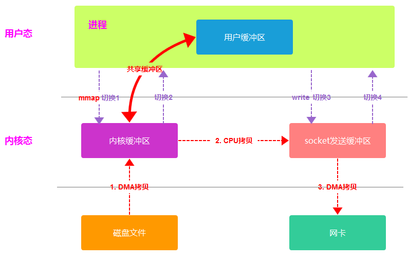
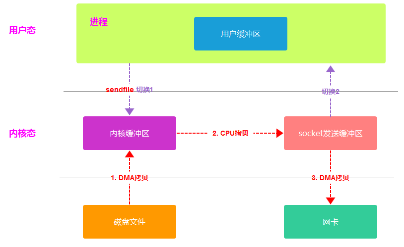
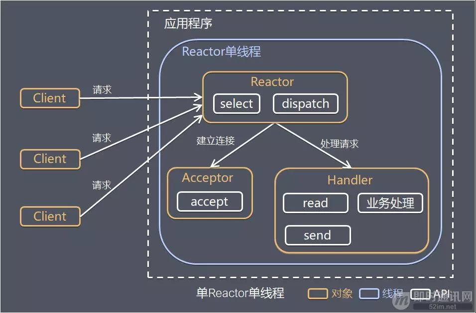
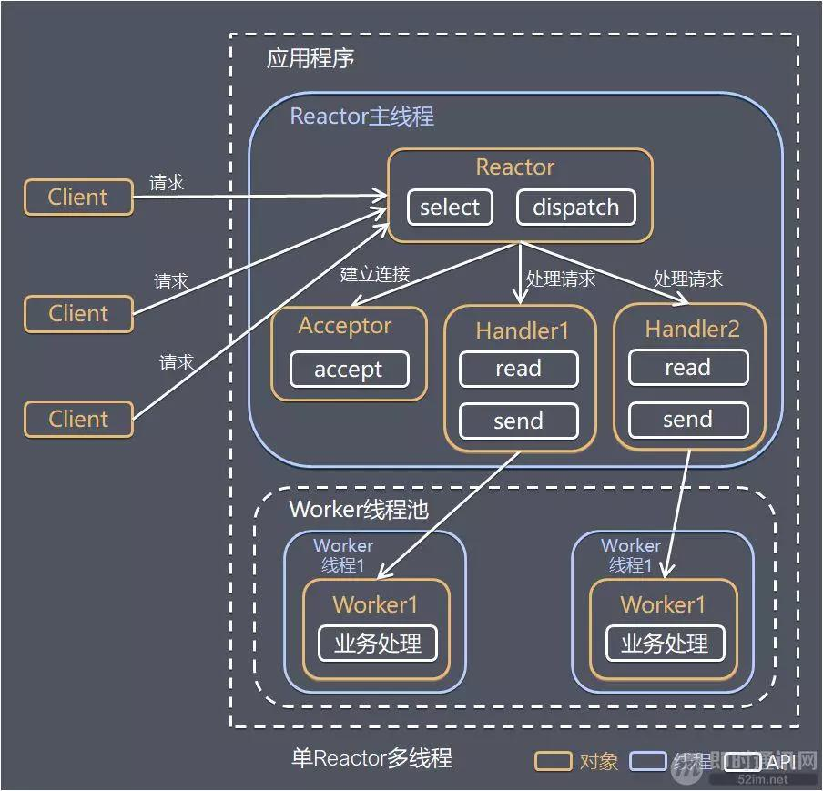
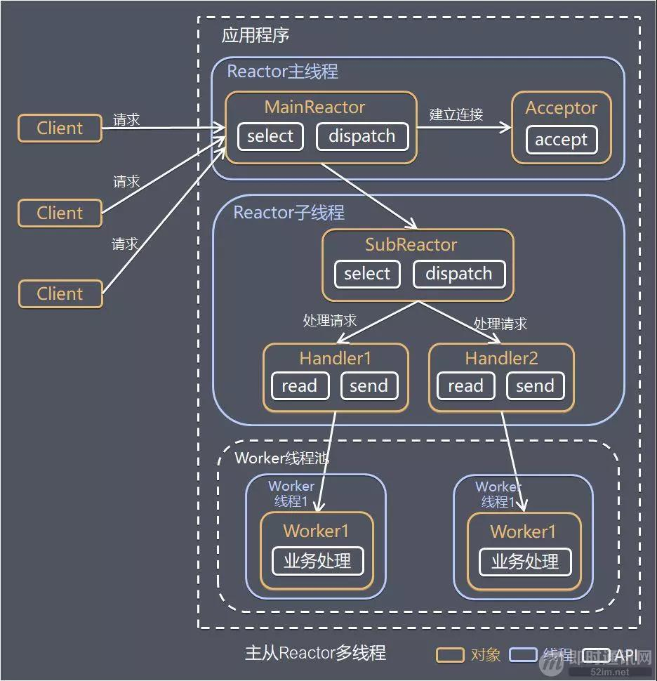

# Netty

## 和NIO比有什么优点

- API简单，开发门槛低
- 功能强大，支持多种主流协议，可靠性强
- 定制能力强，可以通过ChannelHandler对通信框架进行灵活的定制
- 成熟，稳定，修复了NIO的epoll 空轮询 bug
- 社区活跃，版本迭代周期短
- 经历了大规模商业应用的考验，质量高

## Netty内存模型

主从Reactor模型

```java
NioEventLoopGroup boss = new NioEventLoopGroup(1);
NioEventLoopGroup worker = new NioEventLoopGroup(2);

ServerBootstrap serverBootstrap = new ServerBootstrap();
serverBootstrap.group(boss,worker)
    .channel(NioServerSocketChannel.class)
    .localAddress(new InetSocketAddress(8090))
    .childHandler(new ChannelInitializer<SocketChannel>() {
        @Override
        protected void initChannel(SocketChannel ch) throws Exception {
            ch.pipeline().addLast(new StringDecoder());
        }
    });
```

## Netty如何解决拆包粘包

Netty提供了多种解码器，来实现拆包粘包

- LineBasedFrameDecoder，根据换行符对包进行拆分
- DelimiterBasedFrameDecoder，通过自定义分隔符对包进行拆分
- FixedLengthFrameDecoder，设置固定长度，进行数据传输，长度不够使用空格补全
- LengthFieldBasedFrameDecoder，动态长度拆分，按照应用层数据包的大小进行拆包

## Netty如何实现零拷贝

### 传统网络数据拷贝


传统IO的工作方式是：数据读取和写入是从用户空间到内核空间来回复制，内核空间通过操作系统IO接口从磁盘读取或写入。期间总共发生了**4次数据拷贝**，**4次上下文切换**

- 发生了2次系统调用，一次read，一次write，每次系统调用都需要从用户态切换到内核态，等内核处理完成后，再从内核态切换成用户态。
- 4次数据拷贝，其中2次DMA拷贝，2次CPU拷贝
  - 第一次拷贝：把数据从磁盘拷贝到内核缓冲区，DMA
  - 第二次拷贝：从内核缓冲区拷贝到用户缓冲区，CPU
  - 第三次拷贝：从用户缓冲区拷贝到socket发送缓冲区，CPU
  - 第四次拷贝：从socket发送缓冲区拷贝到网卡，DMA

**如何减少上下文切换的次数？**

用户空间没有权限操作磁盘、网卡，只能让内核去操作；一次系统调用必然会发生2次上下文切换

所以要减少上下文切换的次数，必须**减少系统调用**的次数

**如何减少数据拷贝的次数？**

传统的文件传输需要经过4次数据拷贝，而这里面从内核缓冲区到用户缓冲区，从用户缓冲区到socket缓冲区，这个过程是没必要的，因为在文件传输的过程中，在用户空间，我们并不会对文件进行操作再加工，所以可以不用将数据搬运到用户空间。

### 什么是零拷贝

### 零拷贝实现方案

- mmap + write

在前面我们知道，read系统调用会把内核缓冲区的数据拷贝到用户缓冲区，为了减少这一步的开销，使用mmap替换read系统调用函数

mmap会直接把内核缓冲区里的数据映射到用户空间，这样系统内核与用户空间不需要进行数据拷贝



- 应用进程调用mmap后，DMA将数据从磁盘中拷贝到内核缓冲区，接着用户缓冲区与内核缓冲区共享
- 应用进程再调write，操作系统直接将内核缓冲区数据，拷贝到socket发送数据缓冲区，由CPU来完成
- 最后，把内核的socket缓冲区数据拷贝到网卡的缓冲区里，这个过程由DMA来搬运

总结：可以减少1次数据拷贝，上下文切换还是4次

- sendfile

sendfile可以替代前面的read + write这2个系统调用，这样就可以减少1次系统调用，也就减少了2次上下文切换

sendfile系统调用可以直接把内核缓冲区的数据拷贝到socket缓冲区，不再拷贝到用户态，这样就只有2次上下文切换和3次数据拷贝。



对于网卡支持SG-DMA技术的情况下，sendfile系统调用过程发生如下变化：

- 第一步，通过DMA将数据从磁盘拷贝到内核缓冲区
- 第二部，将缓冲区描述符和数据长度传到socket缓冲区，这样网卡的SG-DMA控制器就可以直接将内核缓冲区的数据拷贝到网卡的缓冲区中，相比之前减少了1次数据拷贝

整个过程只进行了**2次切换，2次拷贝**


这就是所谓的**零拷贝技术**，因为我们没有在内存层面去拷贝数据，也就是说全程没有CPU来参与搬运数据，所有的数据都是通过DMA来进行传输

零拷贝技术相比传统的传输方式去传输文件，减少了2次上下文切换，2次数据拷贝，而且2次数据拷贝的过程都由DMA来完成，大大提高了文件传输的性能。

### Netty是怎么做的

- Netty提供了CompositeByteBuf类，它可以将多个ByteBuf合并为一个逻辑上的ByteBuf，避免各个ByteBuf之间的拷贝
- 通过warp操作，将byte[]数组，ByteBuf，ByteBuffer包装成一个Netty的ByteBuf对象，进而避免了拷贝操作
- ByteBuf支持slice操作，因此可以将ByteBuf分解为多个共享同一存储区域的ByteBuf，避免了内存的拷贝
- 通过FileRegion包装的FileChannel.tranferTo实现文件传输，可以直接将文件缓冲区的数据发送到目标Channel，避免了传统通过循环while方式的内存拷贝问题

## Netty如何解决NIO Epoll空轮询问题

- 什么是epoll：epoll是Linux操作系统的一种IO多路复用器，通过`epoll_create`在内核开辟一块空间，`epoll_ctl`来管理内核中的 fd，可以添加，删除，修改。在内核中基于红黑树+链表的结构来实现存储。应用程序通过 epoll_wait 判断是否有事件发生，当某个 fd 有事件触发时，将 fd 加入到链表中，epoll_wait 返回结果大于0，将结果返回给应用程序，由应用程序来处理 fd 事件
- NIO的epoll 空轮询bug：`selector.select()`轮询事件返回数量0，本应该阻塞的 select 仍然被NIO唤醒，在while(true)循环里，不停的轮询，导致CPU100%
- 产生问题的原因：epoll对于突然中断的socket连接会返回`EPOLLHUP`，`EPOLLERR` 事件，fd 上有事件被触发，导致 selector 被唤醒。而 NIO API中又没有定义这类异常的事件，只定义了 `OP_READ`，`OP_WRITE`，`OP_CONNECT`，`OP_ACCEPT`
- **怎么解决的**：
  - 对Selector的select操作周期进行统计，每完成一次空的select操作进行一次计数
  - 若在某个周期内连续发生N次空轮询，则触发了epoll 死循环bug
  - 重新创建一个 Selector，将Selector上注册的Channel转移到新的Selector上
  - 将旧的Selector关闭，使用新的Selector替换

# Reactor模型

基于IO复用：多个连接公用一个阻塞对象，应用程序只需要在一个对象上等待，无需阻塞等待所有连接。当某条连接有新的数据可以处理时，操作系统通知应用程序，线程从阻塞状态返回，开始进行业务处理

基于线程池复用线程资源：不必再为每一个连接创建线程，将连接完成后的业务处理任务分配给线程处理，一个线程可以处理多个连接的业务。

Reactor模式的设计思想就是IO复用结合线程池。Reactor模式，是指通过一个或多个输入同时传递给服务处理器的服务请求的事件驱动处理模式

Reactor模式有2个关键组成：

- Reactor：在一个单独的线程中运行，负责监听和分发事件，分发给适当的处理程序来对IO事件作出反应
- Handlers：处理程序执行IO事件要完成的实际事件，通过调度适当的处理程序来响应IO事件，处理程序执行非阻塞操作

## 单Reactor单线程



- Reactor通过select监控客户端请求事件，收到事件后通过Dispatch进行分发
- 如果是建立连接请求，则由Acceptor通过accept处理连接请求，然后创建一个Handler对象处理连接完成后的后续业务处理
- 如果不是建立连接请求，则由Reactor分发给连接对应的Handler来响应
- Handler会完成 Read===》业务处理===》send 的流程

优点：模型简单，没有多线程、进程通信、竞争的问题，全部在一个线程内完成

缺点：

（1）只有1个线程，无法完全发挥多核CPU的性能——可以部署多个实例来解决

（2）Handler在处理某个连接业务时，整个进程无法处理其他连接事件，很容易导致瓶颈

（3）可靠性问题，线程意外跑飞，或者进入死循环，会导致整个系统通信模块不可以，不能接收和处理外部消息，造成节点故障

使用场景：客户端数量有限，业务处理非常快，比如 Redis

## 单Reactor多线程



- Reactor对象通过select监控客户端请求事件，然后通过Dispatch进行分发
- 如果是建立连接事件，则交给Acceptor处理accept事件，然后创建一个Handler来处理对象连接完成后续的各种事件
- 如果不是建立连接事件，则Reactor会分发给连接对应的Handler来处理
- Handler只负责响应事件，不做具体的业务处理，通过read读取数据，然后分发给worker线程池处理业务
- worker线程池会分配独立的线程完成真正的业务处理，将响应结果发给Handler进行处理，Handler收到响应结果通过send将结果返回给client

优点：充分利用多CPU的处理能力

缺点：多线程数据共享和访问比较复杂；Reactor承担所有事件的监听和响应，在单线程中运行，高并发场景下容易成为性能瓶颈

## 主从Reactor模型



- Reactor主线程MainReactor通过select监控客户端连接事件，收到事件后通过Acceptor接收，并处理建立连接事件
- Acceptor处理建立连接事件后，MainReactor将连接分配给Reactor子线程SubReactor进行处理
- SubReactor将连接加入连接队列进行监听，并创建一个Handler用于处理各种连接事件
- 当有事件发生时，SubReactor会调用连接对应的Handler进行相应
- Handler通过read读取数据后，分发给worker线程池进行业务处理
- worker线程池会分配独立的worker完成真正的业务处理，并将响应结果返回给Handler
- Handler将结果通过send返回给客户端

优点：父线程和子线程数据交互简单，职责明确，父线程只接收连接事件，子线程只接收读写事件，业务逻辑由线程池完成

使用场景：Nginx主从Reactor多进程模型，Memcached主从多线程，Netty主从多线程模型