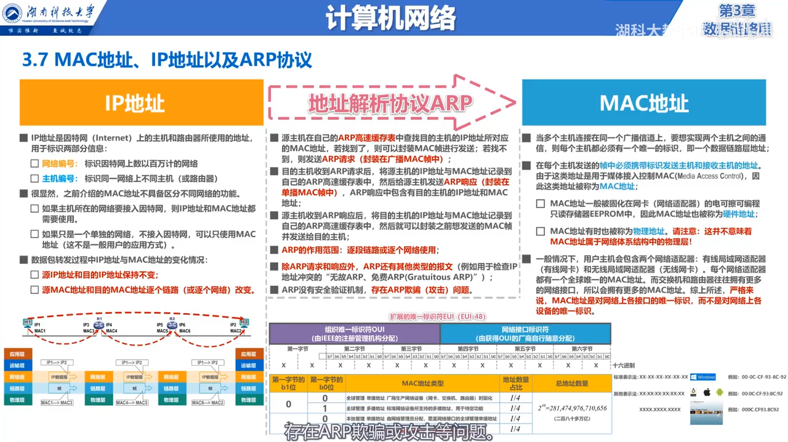
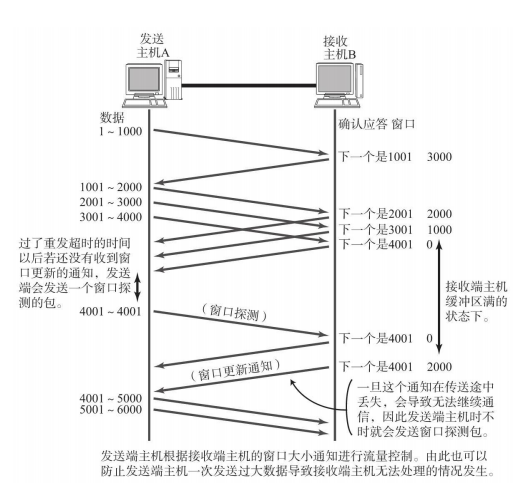

# 网络模型

## OSI七层网络模型

自上向下分别为：应用层、表示层、会话层、运输层、网络层、数据链路层、物理层

# 一次HTTP请求流程

第一阶段：客户端发送数据

- 浏览器中输入一个网址，根据DNS服务器解析出域名所在服务器所在的IP和端口
- 应用层将请求数据组装成HTTP报文
- 传输层接收应用层的报文，加上TCP首部，用来区分应用进程，实现可靠传输
- 网络层接收传输层的数据报，加上IP首部，组成IP数据报
- 数据链路层接收网络层的IP数据报，加上数据报头尾加上帧头帧尾，组成帧
- 物理层把帧看做是比特流，加上前导码，让目的主机做好接收帧的准备
- 网络设备将比特流变成电信号在网络中进行传输

第二阶段：中转数据

- 物理层将电信号转成比特流数据，去掉前导码，将帧交给数据链路层处理
- 数据链路层去掉帧头帧尾，将IP数据报交给网络层处理
- 网络层解析IP数据报首部，提取目的主机地址，查找路由表，确定转发端口
- 网络层将IP数据报交给数据链路层，加上头部和尾部，组成帧
- 数据链路层将帧交给物理层，物理层把帧看做是比特流，加上前导码

第三阶段：服务端接收数据

- 物理层将电信号转成比特流数据，去掉前导码，将帧交给数据链路层处理
- 数据链路层去掉帧头帧尾，将IP数据报交给网络层处理
- 网络层去掉IP首部，将数据包交给传输层处理
- 传输层去掉TCP首部，将HTTP报文交给应用层处理
- 应用层解析报文，处理请求，将响应数据组装成HTTP报文进行响应
- 响应数据在各网络的过程与发送数据一致，在Web层层封装，由路由器进行转发，最终响应给客户端

# MAC与IP地址

- MAC地址是网络上各个接口的唯一标识，作用于数据链路层，数据包在转发的过程中源MAC地址和目的MAC地址逐个链路改变
- IP地址由网络编号和主机编号组成，是主机和路由器使用的地址，作用于网络层，数据包在转发的过程中源IP地址和目的IP地址保持不变
- 源主机通过ARP协议，解析IP地址找到MAC地址

# TCP和UDP的区别

| TCP                        | UDP                 |
| -------------------------- | ------------------- |
| 面向连接                   | 无连接              |
| 可靠传输                   | 不可靠传输          |
| 一对一，单播               | 单播、多播          |
| 首部最小20字节，最大60字节 | 首部开销小，仅8字节 |
| 面向字节流                 | 面向应用报文        |

# TCP首部报文段格式

# TCP如何建立连接

## 三次握手

- 服务端程序启动，监听端口，关闭CLOSED-----》监听LISTEN
- 客户端主动发起连接建立请求，TCP首部SYN=1，表示这是一个TCP连接请求报文段，序号字段seq=x，客户端进入SYN-SENT状态
- 服务端收到连接后，发送确认报文段，SYN=1，ACK=1，表示这是一个TCP连接请求确认报文段，序号字段seq=y，确认号字段ack=x+1，服务端进入SYN-RCVD状态
- 客户端收到响应后，向服务端发送一个普通确认报文段，ACK=1，序号字段seq=x+1，确认号字段ack=y+1，客户端进入ESTABLISHED状态
- 服务端收到客户端的确认报文，进入ESTABLISHED状态
- 两端可以基于本次连接进行通信，传输数据

## 为什么需要第三次握手

连接的建立，需要双方互相确认。

如果没有第三次握手，那么会发生如下情况：

如图所示：

- 客户端发起一次TCP连接请求后，超时了，请求滞留在网络中，客户端重试，重新发起TCP连接
- 服务端接收到连接请求，响应确认，进入连接已建立状态
- 客户端收到响应确认，进入连接已建立状态
- 客户端服务端进行数据通信，然后通过四次挥手释放连接，两端都进入关闭状态
- 这时，滞留在网络中的连接到达了服务端，服务端以为是客户端的连接请求，响应确认，进入连接已建立状态
- 而客户端并未实质性的发请求，会忽略服务端的响应，仍处于关闭状态
- 这就导致了服务端已经处于连接已建立状态，一直等待客户端发送数据，造成服务端资源被浪费

**总结：**第三次握手，就是为了防止上一次连接发出的报文滞留在网络节点中，在连接释放后的某个时间点到达了服务端，服务端误以为是客户端的新连接，响应确认，进入连接已建立的状态，等待客户端发送数据。而实际上客户端是处于关闭状态，不会理会服务端的确认，这就导致了服务端资源的白白浪费。

# TCP如何断开连接

## 四次挥手

- 客户端发送连接释放报文，FIN=1，ACK=1，表示这是一个关闭连接报文，序号字段seq=u，确认号字段ack=v表示对上一个报文的确认，客户端进入FIN-WAIT-1状态
- 服务端收到连接关闭报文，服务端发送普通的确认报文，ACK=1，序号字段seq=v，确认号字段ack=u+1，服务端进入`CLOSE-WAIT`状态，TCP服务进程通知应用进程客户端要断开连接，此时TCP连接处于**半关闭状态**
- 客户端收到服务端响应进入FIN-WAIT-2状态
- 服务端处理完数据后，向客户端发送一个连接释放报文，FIN=1，ACK=1，序号字段=w，确认号字段ack=u+1表示对上一个报文的确认，服务端进入LAST-ACK状态
- 客户端收到连接关闭报文，向服务端发送普通的确认报文，ACK=1，序号字段seq=u+1，确认字段号ack=w+1，客户进入TIME-WAIT状态
- 服务端收到客户端确认响应后，进入CLOSED状态
- 客户端在等待2MSL后进入CLOSED状态

## 为什么需要等待2MSL后将状态变为CLOSED?

> MSL：最长报文段寿命

- 由于客户端确认报文可能会在网络中丢失，服务端在一段时间内收不到客户端的确认响应报文，就会重发连接释放的报文

- 如果客户端不等待一段时间，直接进入CLOSED状态，就不会理会服务端重发的连接释放报文，无法给服务端响应
- 这就造成TCP进程会反复的重传TCP连接释放报文，并一直处于LAST-ACK最后确认状态，无法进入关闭状态

总结：时间等待状态2MSL，就可以确保TCP服务进程可以收到最后一个TCP确认报文段而进入关闭状态。另外，在客户端进程发送最后一个TCP确认报文段后，再经过2MSL时长，就可以使本次连接持续时间内所产生的所有报文段在网络中消失。这样可以使下一个新的连接中不会有旧的报文段出现。

## TCP保活计时器

当TCP双方建立了连接，客户端进程所在主机出现故障，服务端就收不到客户端进程所发来的数据。因此，应当有措施让服务端进程不白白的等待下去。

怎么解决：TCP服务进程每收到一次TCP客户端进程的数据，就会重新设置并启动一个**保活计时器**（2小时定时），若保活计时器在定时周期内未收到TCP客户端进程的数据，TCP服务进程就会向TCP客户端进程发送一个探测报文段，以后每隔75秒发送一次，若发送10个后，客户端还是未响应，服务端就认为客户端出现故障，接着就关闭这个连接

# TCP拆包、粘包

TCP会根据缓冲区的大小，对数据包进行划分，一个完整的数据包可能会拆分成多个包发送，也可能把多个小包合并成一个大包发送，这就是TCP拆包、粘包

## 拆包粘包产生原因

- 发送端写入的数据大于TCP发送剩余缓冲区的大小，就会进行拆包
- 待发送的数据大于MSS，TCP在传输前进行拆包
- 发送端写入的数据小于TCP发送缓冲区的大小，TCP将多次写入缓冲区的数据一次性发送，这会发生粘包
- 接收方不及时读取缓冲区数据，将会发生粘包

## 拆包粘包的解决办法

- **固定数据包的长度**，发送端将每个数据包封装为固定长度，不够补0，这样接收端每次从接收缓冲区中读取固定长度的数据
- **数据包之间设置边界符号**，在数据包之间设置边界，比如添加一些特殊符号，这样接收端可以根据边界将不同数据包拆分开来

- **在数据包首部增加数据长度**，接收方根据长度解析数据

# TCP是如何保证可靠性的

TCP通过校验和、序列号、确认应答、重发机制、连接管理以及窗口控制等机制来实现可靠传输

- 基于**以字节为单位的滑动窗口**来实现可靠传输
- 对于不按序到达的数据，先临时存放在接收窗口中，等到字节流中缺少的字节到后，再按序交付上层的应用进程
- TCP要求接收方必须有**累积确认**和**捎带确认**机制，这样可以减少传输开销。接收方可以在合适的时候发送确认，也可以在直接有数据要发送的时候把确认信息顺便捎带上。
- TCP是全双工通信，通信的每一方都在发送和接收报文段，因此，每一方都有发送窗口和接收窗口

## 序列号和确认应答

当发送端的数据到达接收主机时，接收端主机会返回一个已收到消息的通知，这个消息称为**确认应答（ACK)**

在发送端发出数据后，如果在一段时间内未收到确认应答，发送方就可以认为数据丢失（丢包），并进行重发。这就保证了即使消息丢失，仍能够保证数据可靠传输

发送端未收到确认应答，并不一定是服务端没收到数据，也可能是服务端的确认应答的报文丢了，此时发送端重发后，服务端必须要进行对消息进行识别，重发的这个报文是否处理过。

通过**序列号**来保证数据不重复消费，序列号是按顺序给每个发送报文都标上一个编号。

## 重发超时时间如何选择

重发超时时间是指，发送端在等待服务端确认应答到来的某个时间，如果超过这个时间仍未收到应答，发送端进行重发。

这个时间该如何设定？

重发超时时间 = 往返时间（RTT） + 偏差时间，每次发送报文都会计算这个时间

- 不能直接选择某次测量得到的RTT样本计算超时重传时间RTO

- 利用每次测量得到的RTT样本，计算加权平均往返时间RTTs
- 超时重传时间RTO应略大于加权平均往返时间RTTs

## 连接管理

数据通信之前，TCP双方需要经过3次握手建立连接

数据传输结束之后，TCP双方需要经过4次挥手释放连接

通过连接让两端在数据通信之前做好准备。

## 数据发送单位

TCP数据发送以段为单位，最大消息长度（MSS），TCP在传输数据时，会根据MSS的大小对数据进行分割发送。MSS大小是在三次握手的时候计算出来的。

## 窗口控制

利用窗口控制提高速度

# 流量控制

概念：发送方的发送速率不要太快，要让接收方来得及接收

实现方式：利用**滑动窗口机制**在TCP连接上实现对发送方的流量控制

TCP首部中记录着窗口大小，当接收端的缓冲区一旦面临数据溢出，窗口大小的值也会被设置成更小的值通知给发送端，从而控制数据发送量

- 发送方根据滑动窗口大小，批量发送报文数据
- 接收方对报文进行累计确认，如果缓冲区数据满了，就会调整接收窗口，通过响应报文段给到发送端
- 发送方调整窗口大小，判断是否还能发送数据，如果还能则继续发送，如果不能则不再发送数据。
- 发送端如果批量发送的某个报文丢了，则对其进行重传，不发送其他数据
- 当滑动窗口大小为0时，发送方就会暂停发送数据

**零窗口探测**

- 当接收端缓冲区又有了一些存储空间，接收窗口从0变大后，将向发送端发送一个非0窗口报文，然后等待发送端发送数据
- 如果这个非0窗口报文在网络中丢失了，主机A一直等待主机B的非0窗口报文，主机B等待主机A的数据，就陷入互相等待的局面，造成死锁。
- 为了解决这个死锁问题，TCP为每个连接设置了一个持续计时器
  - 当主机A接收到0窗口报文，就会启动一个持续计时器
  - 当持续计时器超时，主机A立刻发送一个零窗口探测报文（携带1字节），
    - 如果主机B接收窗口仍为0，主机B响应报文，给出窗口大小为0，主机A重新启动一个持续计时器，当计时器超时，主机A继续发送一个零窗口探测报文
    - 如果主机B接收窗口不为0了，主机B响应报文，给出当前能接受的窗口大小，主机A根据重新设定滑动窗口大小，根据窗口大小发送数据
  - 如果主机A发送的零窗口探测报文丢失，会进行重传

> 主机B接收窗口为0，为什么还能接受主机A的零窗口探测报文，这是由于TCP规定了即使接收窗口大小为0，也必须接受零窗口探测报文、确认报文段、以及携带有紧急数据的报文段

# 拥塞控制

> 对网络中某一资源的需求超过了该资源所能提供的可用部分，网络性能就要变坏。这种情况就叫做**拥塞**
>
> 若出现拥塞而不进行控制，整个网络的吞吐量将随输入负荷的增大而下降

**拥塞算法：**

- 慢开始
- 拥塞避免
- 快重传
- 快恢复

发送方维护一个拥塞窗口cwnd的状态变量，其值取决于网络的拥塞程度，并且动态变化

- 拥塞窗口cwnd的维护原则：只要没有出现拥塞，拥塞窗口就增大一些；但只要一出现拥塞，拥塞窗口就减少一些
- 判断出现网络拥塞的依据：发生超时重传

**发送方将拥塞窗口作为发送窗口swnd，即swnd=cwnd**

维护一个慢开始门限ssthresh状态变量：

- 当 cwnd < ssthresh，使用慢开始算法
- 当 cwnd > ssthresh，停止慢开始算法，改用拥塞避免算法
- 当 cwnd = ssthresh，即可以使用慢开始算法，也可以使用拥塞避免算法

## 慢开始与拥塞避免

- 在慢开始阶段，拥塞窗口值按**指数级增长**（1-2-4-8），当窗口值增大到慢开始门限值，则使用拥塞避免算法
- 在拥塞避免阶段，拥塞窗口值只能线性加1，假设当增加到24时，发送端在发送报文时发生了超时重传，则发送端判断网络可能出现了拥塞，则会进行以下工作：
  - 将慢开始门限值ssthresh更新为发生拥塞时cwnd值的一半
  - 将cwnd值调整为1，并重新开始执行慢开始算法

> 慢开始：是指一开始向网络中注入的报文段少，并不是指拥塞窗口增长速度慢
>
> 拥塞避免：并非完全能够避免拥塞，而是在拥塞避免阶段将拥塞窗口控制为按线性增长，使网络不容易出现拥塞

## 快重传与快恢复

**背景：**有时候，个别报文段会在网络中丢失，但实际网络并未发生拥塞，这将导致发送方超时重传，并误认为网络发生了拥塞，发送方将拥塞窗口调整为1，并错误地启动慢开始算法，因而降低了传输效率

**快重传：**使发送方尽快进行重传，而不是等超时重传计时器超时再重传。

- 要求接收方不要等待自己发送数据时才进行捎带确认，而是要**立即发送确认**
- 即使收到了失序的报文段也要立即发出对已收到的报文段的**重复确认**
- 发送方一旦**收到3个连续的重复确认**，就将相应的报文段**立即重传**，而不是等超时重传计时器超时再重传

> 对于个别丢失的报文段，发送方不会出现超时重传，也就不会误认为出现拥塞（进而降低拥塞窗口cwnd为1），使用快重传可以使整个网络的吞吐量提高约20%

**快恢复**：发送方一旦收到3个重复确认，就知道现在只是丢失个别报文段，于是不启动慢开始算法，而是**执行快恢复算法**

- 发送方将慢开始门限值ssthresh和拥塞窗口cwnd值调整为当前窗口的一半；开始执行拥塞避免算法

