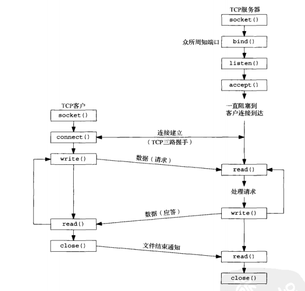
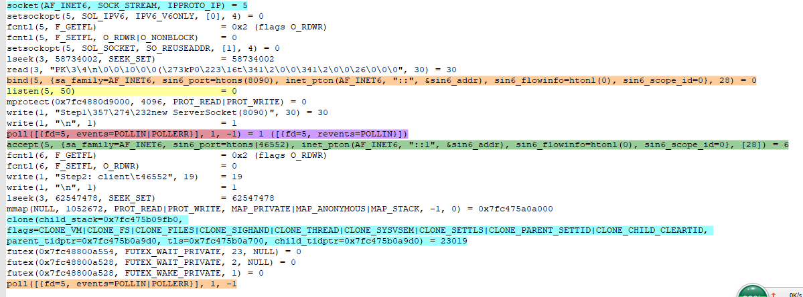
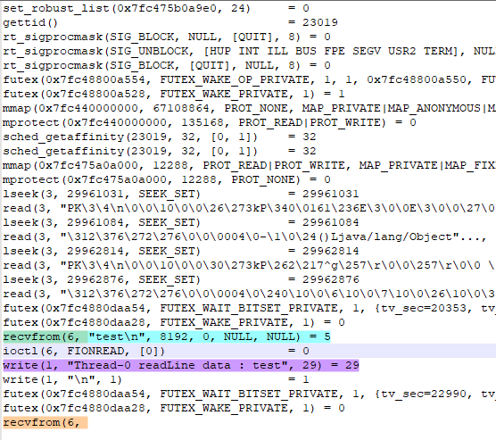
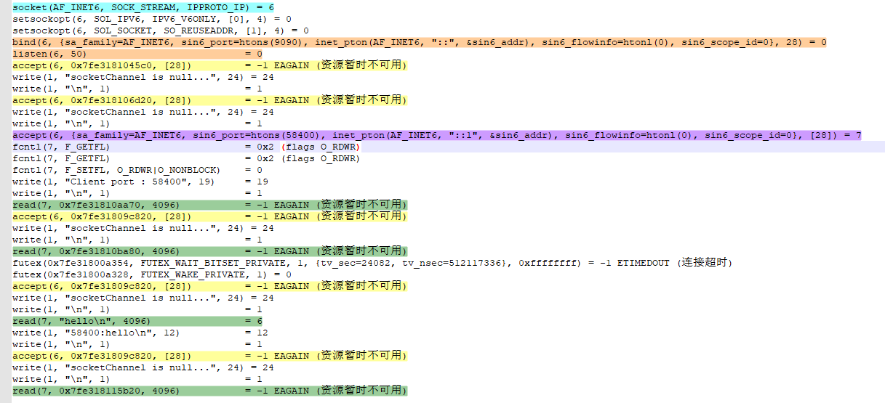
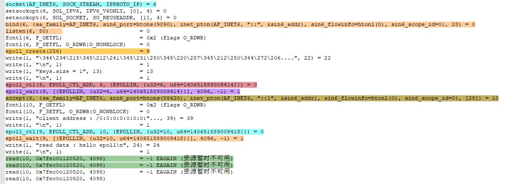

# 系统调用追踪指令

```bash
# 跟踪SocketBIO程序
strace -ff -o out java SocketBIO
# 模拟客户端，连接服务器
nc localhost 9090
# 查看系统连接状态
netstat -natp
```

# IO模型

无论BIO、NIO、多路复用器，都是**同步 IO 模型**

## BIO

### Java代码

```java
public static void main(String[] args) {
    try {
        ServerSocket serverSocket = new ServerSocket(8090);
        System.out.println("Step1：new ServerSocket(8090)");
        while (true) {
            Socket client = serverSocket.accept();
            System.out.println("Step2: client\t" + client.getPort());
            new Thread(() -> {
                try {
                    InputStream in = client.getInputStream();
                    BufferedReader reader = new BufferedReader(new InputStreamReader(in));
                    while (true) {
                        Thread.sleep(1000);
                        System.out.println(Thread.currentThread().getName() + " readLine data : " + reader.readLine());
                    }
                } catch (Exception e) {
                    e.printStackTrace();
                }
            }).start();
        }
    } catch (IOException e) {
        e.printStackTrace();
    }
}
```

### 内核执行流程

- 当执行 `new ServerSocket(8090)`，系统内核会调用 `socket`，`bind`，`listen` 创建服务端socket，绑定端口，开启监听

  ```bash
  # 创建socket，得到 fd = 5
  socket(AF_INET6, SOCK_STREAM, IPPROTO_IP) = 5
  # 绑定端口
  bind(5, {sa_family=AF_INET6, sin6_port=htons(8090)，....) = 0
  # 开启监听
  listen(5, 50) = 0
  ```

- 在 JDK1.4 会执行accept系统调用阻塞，等待客户端连接

  ```bash
  # 阻塞，等待客户端连接
  accept(5,
  # 接收 端口号为46552的客户端连接，得到客户端连接 fd = 6
  accept(5, {sa_family=AF_INET6, sin6_port=htons(46552), ....) = 6
  # 创建子线程，处理客户端读写
  clone(child_stack=0x7fc475b09fb0, flags=CLONE_VM|CLONE_FS|CLONE_FILES|CLONE_SIGHAND|CLONE_THREAD|CLONE_SYSVSEM|CLONE_SETTLS|CLONE_PARENT_SETTID|CLONE_CHILD_CLEARTID, parent_tidptr=0x7fc475b0a9d0, tls=0x7fc475b0a700, child_tidptr=0x7fc475b0a9d0) = 23019
  # 在子进程out.23019文件中，调用recv阻塞读取客户端数据
  recv(6, 
  # 当客户端有数据输入
  recv(6, "test\n", 8192, 0, NULL, NULL) = 5
  write(1, "Thread-0 readLine data : test", 29) = 29
  ```

- 使用JDK1.8 执行 accept 系统调用，会使用 poll 系统调用阻塞，等待客户端连接

  ```bash
  # 使用poll多路复用器阻塞，等待客户端连接
  poll([{fd=5, events=POLLIN|POLLERR}], 1, -1
  # 当有客户端连接进来后，接收到 POLLIN 事件
  poll([{fd=5, events=POLLIN|POLLERR}], 1, -1) = 1 ([{fd=5, revents=POLLIN}])
  # 接收 端口号为46552的客户端连接，得到客户端连接 fd = 6
  accept(5, {sa_family=AF_INET6, sin6_port=htons(46552), ....) = 6
  # 通过clone创建子线程，处理客户端读写
  clone(child_stack=0x7fc475b09fb0, flags=CLONE_VM|CLONE_FS|CLONE_FILES|CLONE_SIGHAND|CLONE_THREAD|CLONE_SYSVSEM|CLONE_SETTLS|CLONE_PARENT_SETTID|CLONE_CHILD_CLEARTID, parent_tidptr=0x7fc475b0a9d0, tls=0x7fc475b0a700, child_tidptr=0x7fc475b0a9d0) = 23019
  # 在子进程out.23019文件中，调用recv阻塞读取客户端数据
  recvfrom(6, 
  # 当客户端有数据输入
  recvfrom(6, "test\n", 8192, 0, NULL, NULL) = 5
  write(1, "Thread-0 readLine data : test", 29) = 29
  ```

### 伪代码

```java
socket() = 5;
bind(5, 8090);
listen(5, 50);
while(true){
	// 阻塞，接收客户端连接
	accept(5,) = fd;
    // 创建线程，处理客户端数据
	clone() = while(true){
        // 阻塞，接收客户端数据
		recv(fd,);
	}
}
```

### 总结

可以看到，真正的BIO是在jdk1.4之前，之后使用poll多路复用器来获取连接

- 概念：BIO，对于每个客户端连接，都会创建一个线程来处理客户端数据。一连接，一线程

- 缺点：
  - 大量连接接入时，需要创建很多线程，浪费系统资源
  - CPU在给线程分配资源的时候，需要频繁的进行内核空间与用户空间的切换，造成大量切换的开销
  - 阻塞，建立连接阻塞，读取数据阻塞
- 解决方案：采用非阻塞方式，于是就有了NIO的诞生

## NIO

### Java代码

```java
public static void main(String[] args) {
    LinkedList<SocketChannel> clients = new LinkedList<>();
    try {
        ServerSocketChannel channel = ServerSocketChannel.open();
        channel.bind(new InetSocketAddress(9090));
        channel.configureBlocking(false);

        while (true) {
            Thread.sleep(2000);
            SocketChannel socketChannel = channel.accept();
            if (socketChannel == null) {
                System.out.println("socketChannel is null...");
            } else {
                socketChannel.configureBlocking(false);
                int port = socketChannel.socket().getPort();
                System.out.println("Client port : " + port);
                clients.add(socketChannel);
            }

            ByteBuffer byteBuffer = ByteBuffer.allocateDirect(4096);
            for (SocketChannel sc : clients) {
                int num = sc.read(byteBuffer);
                if (num > 0) {
                    byteBuffer.flip();
                    byte[] a = new byte[byteBuffer.limit()];
                    byteBuffer.get(a);
                    String b = new String(a);
                    System.out.println(sc.socket().getPort() + ":" + b);
                    byteBuffer.clear();
                }
            }
        }
    } catch (Exception e) {
        e.printStackTrace();
    }
}
```

### 内核执行流程

- 创建socket、绑定端口、开启监听

  ```bash
  socket(AF_INET6, SOCK_STREAM, IPPROTO_IP) = 6
  bind(6, {sa_family=AF_INET6, sin6_port=htons(9090), ...) = 0
  listen(6, 50)                           = 0
  ```

- 设置获取客户端连接非阻塞

  ```bash
  fcntl(6, F_SETFL, O_RDWR|O_NONBLOCK)    = 0
  ```

- 执行channel.accept，进行系统调用，不阻塞，获取结果为null，往下继续执行

  ```bash
  # 当没有客户端连接时，返回 -1
  accept(6, 0x7fe3181045c0, [28])         = -1 EAGAIN (资源暂时不可用)
  write(1, "socketChannel is null...", 24) = 24
  ```

- 当有客户端连接进来后，得到客户端连接 fd = 7

  ```bash
  accept(6, {sa_family=AF_INET6, sin6_port=htons(58400), ...) = 7
  # 设置客户端读取数据非阻塞
  fcntl(7, F_SETFL, O_RDWR|O_NONBLOCK)    = 0
  ```

- 执行read读取客户端数据，进行系统调用，不阻塞，没有数据返回 -1

  ```bash
  # 当客户端没有数据发送，返回 -1
  read(7, 0x7fe31810aa70, 4096)           = -1 EAGAIN (资源暂时不可用)
  ```

- 当有客户端数据发送时

  ```bash
  # 读取到数据
  read(7, "hello\n", 4096)                = 6
  ```

### 伪代码

```bash
socket() = 6;
bind(6,9090);
listen(6,50);
fcntl(6, F_SETFL, O_RDWR|O_NONBLOCK);
while(true){
	// 非阻塞，接收客户端连接，没有客户端连接返回-1
	accept(6, {sa_family=AF_INET6, sin6_port=htons(58400), ...) = 7 或 -1 (资源暂时不可用)
	// 遍历客户端连接，读取数据
	for(fd)
        // 非阻塞，读取客户端数据，没有数据则返回 -1
		read(7, "hello\n", 4096)                = 6 或 -1 (资源暂时不可用)
	}
}
```

### 总结

- 概念：NIO，通过一个线程来创建客户连接，读写客户端数据；在Java层面NIO是指New IO，在操作系统层面NIO是指Non Blocking IO
- 优点：面对大量连接，避免了创建大量线程的问题，通过一个线程处理N个连接以及读写
- 缺点：在有大量连接的情况下，若只有1个客户端有数据，每次循环必须向内核发送一次 read 系统调用，造成很多系统调用都是无效的。
- 解决方案：通过IO多路复用器，将所有fd传递给内核，由系统来检测哪些fd是可读状态，遍历可读写的fd，减少read系统调用次数

# 多路复用器

服务端采用单线程，通过 select 、poll、epoll 等系统调用传递 fd 列表到内核，内核遍历有事件的 fd 进行 accept、recv 等操作

IO 多路复用是一种同步 IO 模型，实现一个线程可以监视多个 fd ，一旦某个 fd 就绪，就能通知应用程序进行相对应的读写操作；没有 fd 就绪时就会阻塞程序，交出 CPU

多路是指**多个网络连接**，复用指的是**一个线程**

## select、poll

- select：单个进程打开的FD有限，通过 FD_SETSIZE 设置，默认1024
- poll：没有 FD 限制

**优点**：通过一次系统调用，把 fds 传递给内核，获取可执行 fd 的数量；在内核中进行遍历，减少了系统调用的次数

```c++
int select(int nfds, fd_set *readfds, fd_set *writefds,
                  fd_set *exceptfds, struct timeval *timeout);

int poll(struct pollfd *fds, nfds_t nfds, int timeout);
```

**缺点**：

- 每次调用 select，poll 都需要把 fd 集合传递给内核空间，从用户态拷贝到内核态，这个在 fd 很多时开销很大
- 每次 select ，poll 都需要重新遍历全量的 fd

## epoll

- 通过在内核开辟空间，使用红黑树存储 fd ，避免 fd 集合从用户态到内核态的多次拷贝

### Java代码

```java
static ServerSocketChannel server = null;
static Selector selector = null;

public static void main(String[] args) {
    initServer();
    System.out.println("服务器启动了....");
    try {
        while (true) {
            Set<SelectionKey> selectionKeys = selector.keys();
            System.out.println("keys.size = " + selectionKeys.size());
            while (selector.select() > 0) {
                // 遍历有状态的key
                Set<SelectionKey> keys = selector.selectedKeys();
                Iterator<SelectionKey> iterator = keys.iterator();
                while (iterator.hasNext()) {
                    SelectionKey selectionKey = iterator.next();
                    iterator.remove();
                    if (selectionKey.isAcceptable()) {
                        handleAccept(selectionKey);
                    } else if (selectionKey.isReadable()) {
                        handleRead(selectionKey);
                    }
                }
            }
        }
    } catch (IOException e) {
        e.printStackTrace();
    }

}

public static void initServer() {
    try {
        server = ServerSocketChannel.open();
        server.bind(new InetSocketAddress(9090));
        server.configureBlocking(false);

        selector = Selector.open();
        server.register(selector, SelectionKey.OP_ACCEPT);
    } catch (Exception e) {
        e.printStackTrace();
    }
}

public static void handleAccept(SelectionKey key) {
    try {
        ServerSocketChannel serverSocketChannel = (ServerSocketChannel) key.channel();
        SocketChannel client = serverSocketChannel.accept();
        client.configureBlocking(false);

        ByteBuffer byteBuffer = ByteBuffer.allocateDirect(4098);
        client.register(selector, SelectionKey.OP_READ, byteBuffer);

        System.out.println("client address : " + client.getRemoteAddress());
    } catch (Exception e) {
        e.printStackTrace();
    }
}

public static void handleRead(SelectionKey key) {
    SocketChannel socketChannel = (SocketChannel) key.channel();
    ByteBuffer byteBuffer = (ByteBuffer) key.attachment();
    byteBuffer.clear();
    int read = 0;
    try {
        while (true) {
            read = socketChannel.read(byteBuffer);
            if (read > 0) {
                byteBuffer.flip();
                byte[] a = new byte[byteBuffer.limit()];
                byteBuffer.get(a);
                String b = new String(a);
                System.out.println("read data : " + b);
                byteBuffer.clear();
            }
        }
    } catch (Exception e) {
        e.printStackTrace();
    }
}
```

### 内核执行流程

- 创建socket、绑定端口、开启监听

```bash
socket(AF_INET6, SOCK_STREAM, IPPROTO_IP) = 6
bind(6, {sa_family=AF_INET6, sin6_port=htons(9090), ....) = 0
listen(6, 50)   =  0
```

- 在内核开辟存储空间，存储 fd，得到内核空间的文件描述符 = 9

```bash
# 在内核开辟内存空间
epoll_create(256) = 9
```

- 往内核空间中添加socket连接

```bash
# 往内核空间9中添加 fd=6 的socket
epoll_ctl(9, EPOLL_CTL_ADD, 6, {EPOLLIN, {u32=6, u64=140651589009414}}) = 0
```

- 通过 epoll_wait 系统调用，在超时时间内阻塞等待客户端连接

```bash
epoll_wait(9, 
```

- 当有客户端连接，epoll_wait检测到有客户端连接

```bash
# epoll_wait 返回1，发现 fd=6 上有事件触发
epoll_wait(9, [{EPOLLIN, {u32=6, u64=140651589009414}}], 4096, -1) = 1
# 通过accept系统调用，在 socket=6 上，创建客户端连接 fd = 10
accept(6, {sa_family=AF_INET6, sin6_port=htons(58420), ....) = 10
# 将客户端连接 fd 添加到 系统内核中
epoll_ctl(9, EPOLL_CTL_ADD, 10, {EPOLLIN, {u32=10, u64=140651589009418}}) = 0
# 阻塞，等待fd上有事件发生
epoll_wait(9, 
```

- 客户端又数据写入

```bash
# epoll_wait 返回1，发现 fd=10 上有事件触发
epoll_wait(9, [{EPOLLIN, {u32=10, u64=140651589009418}}], 4096, -1) = 1
# 读取数据
read(10, "hello epoll\n", 4098)         = 12
# 打印数据
write(1, "read data : hello epoll\n", 24) = 24
# 不阻塞，继续循环读取，客户端数据，
read(10, 0x7fec0c120520, 4098)          = -1 EAGAIN (资源暂时不可用)
read(10, 0x7fec0c120520, 4098)          = -1 EAGAIN (资源暂时不可用)
```

### 伪代码

```java
// 创建socket，绑定端口，开启监听
socket() = 6
bind(6, 9090) 
listen(6, 50)
fcntl(6, F_SETFL, O_RDWR|O_NONBLOCK);

// 开辟内核空间
epoll_create(256) = 9
// 将socket添加到内核
epoll_ctl(9, EPOLL_CTL_ADD, 6, {EPOLLIN, {u32=6, u64=140651589009414}}) = 0
epoll_wait(9,  // 阻塞，当有 fd 事件发生，返回结果大于0
// epoll_wait(9, [{EPOLLIN, {u32=6, u64=140651589009414}}], 4096, -1) = 1
// epoll_wait(9, [{EPOLLIN, {u32=10, u64=140651589009418}}], 4096, -1) = 1
while(epoll_wait(9) > 0) {
    if (key.isAcceptable()) {
        // 创建客户端连接 fd
        accept(6, {sa_family=AF_INET6, sin6_port=htons(58420), ...) = 10
        // 设置客户端非阻塞
        fcntl(10, F_SETFL, O_RDWR|O_NONBLOCK)   = 0
        // 将客户端连接添加到内核
        epoll_ctl(9, EPOLL_CTL_ADD, 10, {EPOLLIN, {u32=10, u64=140651589009418}}) = 0
    } else if (key.isReadable()) {
        // 读取数据
        while(true) {
            // 非阻塞，当没有数据读取，返回-1  
            // read(10, 0x7fec0c120520, 4098)          = -1 EAGAIN (资源暂时不可用)
            read(10, "hello epoll\n", 4098)  =  12  (当没有数据读取，返回-1)
        }
    }
}
```

### 总结

- 通过 `epoll_create`，`epoll_ctl`，`epoll_wait`三个系统调用实现

- `epoll_create` ：在内核开辟一块空间，存储文件描述符 fd，返回一个内核空间的描述符epfd
- `epoll_ctl`：内核空间操作
  - EPOLL_CTL_ADD：往内核空间中注册一个 fd
  - EPOLL_CTL_MOD：修改内核空间中注册的fd
  - EPOLL_CTL_DEL：从内核空间中删除注册的fd

- `epoll_wait`：在超时时间内阻塞等待IO事件发生，当有事件发生，则返回发生事件的 fd 数量

每当fd就绪，系统注册回调函数就会被调用，将就绪的fd放到readyList中

# 附录一、案例追踪

## Redis

```bash
# 在内核开辟空间，得到空间fd=5
epoll_create(1024) = 5
# 创建socket，fd=7
socket(AF_INET, SOCK_STREAM, IPPROTO_TCP) = 7
# 在fd=7上绑定6379端口
bind(7, {sa_family=AF_INET, sin_port=htons(6379), sin_addr=inet_addr("0.0.0.0")}, 16) = 0
# 开启监听
listen(7, 511)  = 0
# 将fd=7添加到内核空间
epoll_ctl(5, EPOLL_CTL_ADD, 7, {EPOLLIN, {u32=7, u64=7}}) = 0
# 非阻塞，等待事件触发
epoll_wait(5, [], 10128, 0)             = 0
epoll_wait(5, [], 10128, 100)           = 0
################################################
# 有客户端连接接入
epoll_wait(5, [{EPOLLIN, {u32=7, u64=7}}], 10128, 100) = 1
# 创建客户端连接，得到fd=8
accept(7, {sa_family=AF_INET, sin_port=htons(36250), sin_addr=inet_addr("127.0.0.1")}, [128->16]) = 8
# 将fd=8添加到内核空间
epoll_ctl(5, EPOLL_CTL_ADD, 8, {EPOLLIN, {u32=8, u64=8}}) = 0
# 有数据写入
epoll_wait(5, [{EPOLLIN, {u32=8, u64=8}}], 10128, 15) = 1
# 非阻塞，等待事件触发
epoll_wait(5, [], 10128, 1)             = 0
epoll_wait(5, [], 10128, 100)             = 0
# 客户端fd=8有数据写入，epoll_wait监听到事件发生，执行read
epoll_wait(5, [{EPOLLIN, {u32=8, u64=8}}], 10128, 100) = 1
read(8, "*2\r\n$3\r\nget\r\n$4\r\nname\r\n", 16384) = 23
```


# 附录二、系统调用函数

```c
// 创建一个socket文件描述符，sockfd
int socket(int domain, int type, int protocol);
// 为socket绑定一个端口
int bind(int sockfd, const struct sockaddr *addr, socklen_t addrlen);
// 在socket上开启监听
int listen(int sockfd, int backlog);
// 在socket上接收客户端连接
int accept(int sockfd, struct sockaddr *addr, socklen_t *addrlen);
// 读取 socket fd 上的数据，返回数据长度
ssize_t recv(int sockfd, void *buf, size_t len, int flags);
ssize_t recvfrom(int sockfd, void *buf, size_t len, int flags,
                        struct sockaddr *src_addr, socklen_t *addrlen);
// 读取 fd 上的数据，返回数据长度
ssize_t read(int fd, void *buf, size_t count);

// 在内核开辟空间，返回内核空间文件描述符，epfd
int epoll_create(int size);
// op=add：在内核空间中注册目标fd的事件
// op=mod：修改内核空间中注册的目标fd事件
// op=del：删除内核空间中的fd
int epoll_ctl(int epfd, int op, int fd, struct epoll_event *event);
// 等待内核空间fd有事件发生，可设置超时时间，timeout=-1阻塞，timeout=0 直接返回
int epoll_wait(int epfd, struct epoll_event *events, int maxevents, int timeout);
```

# 附录三、系统调用追踪日志

## 系统调用流程



## BIO主线程



## BIO子线程



## NIO



## EPOLL

