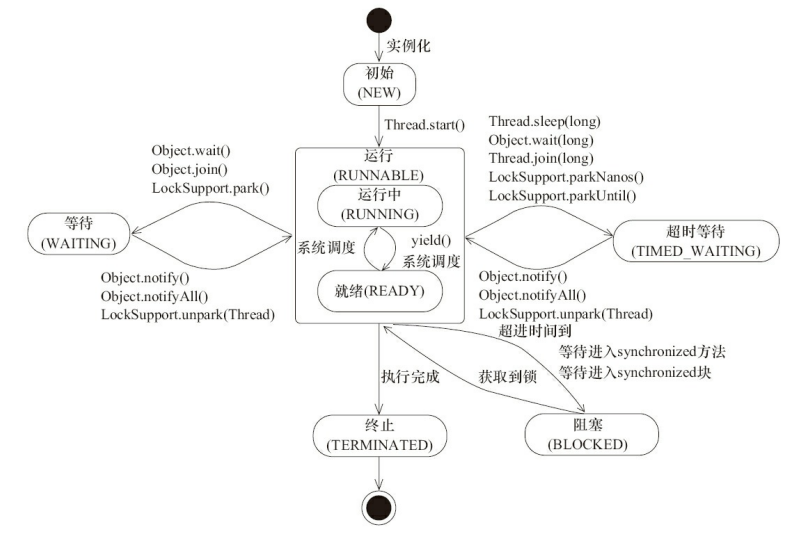
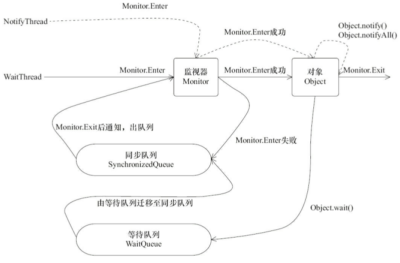
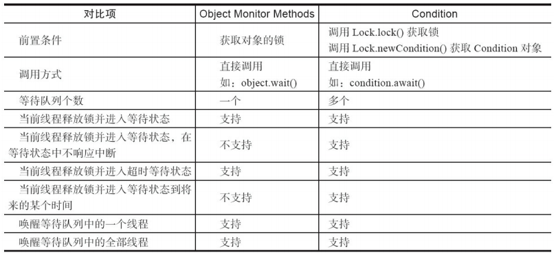

# 线程基本概念

## 什么是线程

操作系统在运行一个程序的时候，会创建一个进程，在这个进程里可以创建多个线程，CPU给每个线程分配时间片来进行调度执行。

CPU通过时间片分配算法来循环执行任务，当前任务执行一个时间片后切换到下一个任务，每次切换的时候需要保存上一个任务执行的状态，以便下一次切换回来的时候，可以再次加载这个状态。

这个保存和加载的过程称为**上下文切换**。

线程是操作系统调度的基本单元

单核处理器也是支持多线程执行代码的。

## 为什么使用多线程

- 最大化的利用计算机多核处理器
- 更快的响应时间RT
- 更好的编程模型

## 多线程一定快吗

答案：**不一定**

线程创建和上下文切换是有开销的，资源保存和加载

## 多线程带来的问题？

- 上下文切换：线程之间切换
- 死锁：线程之间持有对方的锁，然后相互等待
- 资源限制：并发编程所带来的网络带宽，磁盘读写，CPU处理速度等限制；数据库连接，socket连接等

### 怎么减少上下文切换

- 无锁编程：分段锁思想，让多线程不产生竞争
- CAS算法：cas自旋思想，不进行线程切换
- 使用最少的线程：避免创建很多线程，当任务量少的时候，会造成大量线程处于等待状态
- 使用协程：在单线程里进行多个任务调度，维持多个任务间的切换

### 怎么避免死锁

- 避免一个线程同时获取多个锁
- 避免一个线程在锁内同时占用多个资源，尽量保证每个锁只占用一个资源
- 使用定时锁，给锁设定超时时间
- 对于数据库锁：加锁和解锁必须在一个数据库连接里

### 怎么解决资源限制问题

- 硬件层面多机部署
- 软件层面，资源数据复用，比如：数据库连接池

# 并发机制底层原理

## volatile的应用

**作用：**保证了多线程之间共享变量的可见性，防止指令重排

### 如何保证可见性？

编译成汇编后，生成lock addl指令。

**指令作用：**

- Lock前缀指令会引起处理器缓存回写到内存

  Lock#信号一般不锁总线，而是锁缓存

- 一个处理器的缓存回写到内存会使其他CPU的缓存无效

  处理器使用嗅探技术来感知数据变化，保证内部缓存、系统内存和其他处理器的缓存的数据在总线上保持一致

  嗅探到共享数据变更的处理器会将其**缓存行**置为无效

大多数处理器高速缓存行是64个字节，通过填充方式，可以防止**伪共享**的发生

### 伪共享问题

在大多数处理器缓存的高速缓存行是64个字节，读取数据的时候也是按照缓存行进行数据读取。

所以如果有2个变量a，b位于同一缓存行，由不同的线程x，y进行更改；会导致线程x操作a，锁住了缓存行，阻塞了线程y操作变量b；原本是多线程并行的处理不同的变量数据，现在变成了串行执行。

**解决方案：**

通过填充的方式，将变量前后填充一定数量的数据；

通过注解 `@sun.misc.Contended`标识

### 如何保证有序性

通过内存屏障，防止指令重排


## synchronized

jdk1.6后对其进行了优化，为了减少获得锁和释放锁带来的性能消耗而引入了偏向锁，轻量级锁，以及锁的存储结构和升级过程。

**功能：**

修饰同步代码块，锁的是synchronized括号里的object对象

修饰静态方法，锁的是当前类的class对象

修饰普通方法，锁的是当前实例对象

### 实现原理

字节码层面生成2个指令：monitorenter和monitorexit

锁存储在Java对象头中，对象头组成：mark word，class pointer，数组长度

对象头中通过2bit来标识锁状态：无锁，偏向锁，轻量级锁，重量级锁；1bit来标识是否偏向

### 锁升级

无锁--->偏向锁--->轻量级锁----->重量级锁

#### 偏向锁

**引入背景：**大多数情况下，锁不存在多线程竞争，而且总是由同一个线程多次获得，为了让线程获取锁的代价更低，引入了偏向锁

**概念：**当一个线程访问同步代码块并获取锁时，会在对象头和栈帧中的锁记录里存储锁偏向的线程ID，以后该线程进入和退出同步代码块时，不需要CAS来操作加锁和解锁。

**偏向锁撤销**

偏向锁使用了一种等到竞争出现才释放锁的机制。

偏向锁撤销，需要等待全局安全点。

它首先暂停拥有偏向锁的线程，然后检查持有偏向锁的线程是否活着，

如果线程不处于活跃状态，将对象头设置成无锁

如果线程处于活跃状态，遍历偏向对象的锁记录，栈中的锁记录和对象头的mark word要么重新偏向于其他线程，要么恢复到无锁或者标记对象不适合作为偏向锁

最后唤醒暂停的线程

#### 轻量级锁

**加锁**：当前线程在当前栈帧中创建存储锁记录的空间，然后将对象头中的mark word复制到锁记录中，然后尝试使用CAS将对象头中的mark word替换为指向锁记录的指针。如果成功，当前线程获取到锁；如果失败，表示其他线程竞争锁，当前线程使用自旋来获取锁，自旋多次都失败，锁会膨胀成重量级锁

**解锁：**使用CAS操作将栈帧中的mark word替换回到对象头，如果成功，表示没有竞争发生。如果失败，表示当前锁存在竞争，锁就会膨胀成重量级锁


## 原子操作实现原理

**处理器如何实现原子性**

- 使用总线锁保证原子

- 使用缓存锁保证原子性

  （1）当操作的数据跨多个缓存行，处理器会调用总线锁定

  （2）有些处理器不支持缓存行锁定

**Java如何实现原子性**

- 循环使用CAS实现原子操作

  利用了处理器提供的cmpxchg指令实现

- CAS实现原子操作的三大问题

  - ABA问题。一个值原来是A，变成了B，又变成了A。可以通过版本号解决
  - 循环时间长开销大。自旋CAS如果长时间不成功，会给CPU带来非常大的执行开销。
  - 只能保证一个共享变量的原子操作。

- 使用锁机制实现原子操作

  锁机制保证了只有获取到锁的线程才能操作锁定内存区域

# 内存模型

JMM定义了线程和主存之间的抽象关系：线程之间的共享变量存储在主内存中，每个线程都有一个私有的本地内存，本地内存中存储了该线程读/写共享变量的副本。

## **指令重排序**

1）编译器优化的重排序

2）指令级并行的重排序

3）内存系统的重排序

## 内存屏障

- LoadLoad
- LoadStore
- StoreStore
- StoreLoad

## Happen-Before规则

- 程序顺序规则：一个线程中的每个操作，happen-before于该线程中的任意后续操作
- 监视器锁规则：对一个锁的解锁happen-before于随后对这个锁的加锁
- volatile规则：对一个volatile域的写happen-before于任意后续对这个volatile域的读
- 传递性规则：如果A happen-before于B，B happen-before 于C，则A happen-before于C
- start规则：如果线程A执行操作ThreadB.start()，那么A线程的ThreadB.start()操作happen-before于线程B中的任意操作
- join规则：线程A执行操作ThreadB.join()，那么线程B的任意操作都happen-before于线程A的ThreadB.join() 操作

## as-if-serial语义

不管怎么重排序，程序执行的结果不能变。

## volatile内存语义

可见性：对一个volatile变量的读，总是能看到任意线程对这个volatile变量最后的写

原子性：不保证原子性

有序性：禁止指令重排

**写内存语义**

当写一个volatile变量时，JMM会把线程对应的本地内存中的共享变量值刷新到主内存中

**读内存语义**

当读一个volatile变量时，JMM会把该线程对应的本地内存置为无效。程序接下来将从主内存中读取共享变量。

## 锁的内存语义

线程A释放一个锁，实质上是线程A向接下来将要获取这个锁的某个线程发出了消息

线程B获取一个锁，实质上是线程B接收了之前某个线程发出的消息

线程A释放锁，随后线程B获取这个锁，这个过程实质上是线程A通过主内存向线程B发送消息


## final的内存语义

#### final域的重排序规则

- 写final域的重排序规则禁止把final域的写重排序到构造函数之外
  - JMM禁止编译器把final域的写重排序到构造函数之外
  - 编译器会在final域的写之后，构造函数return之前，插入一个StoreStore屏障。这个屏障禁止处理器把final域的写重排序到构造函数之外
- 读final域的重排序规则：在一个线程中，初次读对象引用与初次读该对象包含的final域，JMM禁止处理器重排序这两个操作。编译器会在读final域操作的前面插入一个LoadLoad屏障

## 双重检查锁

```java
public class DoubleLocking{
    private static volatile Instance instance;
    public static Instance getInstance(){
        if(instance == null){
            synchronized(DoubleLocking.class){
                if(instance == null){
                    instance = new Instance();
                }
            }
        }
        return instance;
    }
}

```


# 线程基础知识

## 线程方法


- **sleep**：休眠一段时间，不出让CPU
- **wait**：线程进度等待队列，等待唤醒
- **notify**：唤醒等待队列中的某一个线程，将其移动到同步队列中去，有机会重新获得锁
- **join**：在线程A中执行了thread.join表示在A线程等待thread线程终止后才从thread.join处返回
- **yield**：线程出让CPU时间片


## 线程的状态

```java
public static void main(String[] args) throws InterruptedException {
    
    new Thread(new TimeWaiting(), "TimeWaitingThread").start();
    new Thread(new Waiting(), "WaitingThread").start();
	// 创建两个Blocked线程，一个获取锁成功，一个阻塞
    new Thread(new Blocked(), "BlockedThread-1").start();
    new Thread(new Blocked(), "BlockedThread-2").start();
}

// 该线程不断的休眠
static class TimeWaiting implements Runnable {

    @Override
    public void run() {
        while (true) {
            try {
                Thread.sleep(1000);
            } catch (InterruptedException e) {
                e.printStackTrace();
            }
        }
    }
}
// 该线程在Waiting实例上等待
static class Waiting implements Runnable {

    @Override
    public void run() {
        synchronized (Waiting.class) {
            try {
                Waiting.class.wait();
            } catch (InterruptedException e) {
                e.printStackTrace();
            }
        }
    }
}
// 该线程获取所有，一直执行，不释放锁
static class Blocked implements Runnable {
    @Override
    public void run() {
        synchronized (Blocked.class) {
            while (true) {
                try {
                    Thread.sleep(100);
                } catch (InterruptedException e) {
                    e.printStackTrace();
                }
            }
        }
    }
}

```


```bash
[root@muskmelon00 ~]# jps
23287 Jps
23151 HelloWorld
[root@muskmelon00 ~]# jstack 23151
## BlockedThread-2线程阻塞，监视着BlockedThread-1持有的锁 0x00000000ec460f60
"BlockedThread-2" #11 prio=5 os_prio=0 tid=0x00007fb4180f5800 nid=0x5a7e waiting for monitor entry [0x00007fb4034f3000]
   java.lang.Thread.State: BLOCKED (on object monitor)
        at HelloWorld$Blocked.run(HelloWorld.java:51)
        - waiting to lock <0x00000000ec460f60> (a java.lang.Class for HelloWorld$Blocked)
        at java.lang.Thread.run(Thread.java:748)
## BlockedThread-1 线程持有锁
"BlockedThread-1" #10 prio=5 os_prio=0 tid=0x00007fb4180f4000 nid=0x5a7d waiting on condition [0x00007fb4035f4000]
   java.lang.Thread.State: TIMED_WAITING (sleeping)
        at java.lang.Thread.sleep(Native Method)
        at HelloWorld$Blocked.run(HelloWorld.java:51)
        - locked <0x00000000ec460f60> (a java.lang.Class for HelloWorld$Blocked)
        at java.lang.Thread.run(Thread.java:748)
## WaitingThread线程在waiting实例上等待
"WaitingThread" #9 prio=5 os_prio=0 tid=0x00007fb4180f2800 nid=0x5a7c in Object.wait() [0x00007fb4036f5000]
   java.lang.Thread.State: WAITING (on object monitor)
        at java.lang.Object.wait(Native Method)
        - waiting on <0x00000000ec45fad0> (a java.lang.Class for HelloWorld$Waiting)
        at java.lang.Object.wait(Object.java:502)
        at HelloWorld$Waiting.run(HelloWorld.java:37)
        - locked <0x00000000ec45fad0> (a java.lang.Class for HelloWorld$Waiting)
        at java.lang.Thread.run(Thread.java:748)
## TimeWaitingThread线程处于超时等待 
"TimeWaitingThread" #8 prio=5 os_prio=0 tid=0x00007fb4180f0800 nid=0x5a7b waiting on condition [0x00007fb4037f6000]
   java.lang.Thread.State: TIMED_WAITING (sleeping)
        at java.lang.Thread.sleep(Native Method)
        at HelloWorld$TimeWaiting.run(HelloWorld.java:23)
        at java.lang.Thread.run(Thread.java:748)

```

- New：新建
- Running：运行中
- Waiting：等待
- Timed_Waiting：超时等待
- BLOCKED：阻塞

- Terminated：终止

状态变化

（1）实例化----> new

（2）new------>运行（调用start 等待CPU分配时间片）

（3）运行------>waiting（调用Object.wait()，Object.join() ，LockSupport.park()）

（4）waiting------>运行（调用Object.notify()，Object.notifyAll()，LockSupport.unPark(thread)）

（5）运行------>timed_waiting（调用sleep，Object.wait(long)，Thread.join(long)，LockSupport.parkNanos()，LockSupport.parkUntil()

（6）timed_waiting------>运行（Object.notify()，Object.notifyAll()，LockSupport.unPark()）

（7）运行------->blocked（等待锁）

（8）blocked------->运行（获取到锁）

（9）运行------->terminated（执行结束）



## Daemon线程

Daemon是一种支持型线程，当一个虚拟机中不存在非Daemon线程后，虚拟机将退出

通过Thread.setDaemon(true)将线程设置为Daemon线程，必须在线程启动之前设置

在虚拟机退出后，不会执行Daemon线程中的finally里的代码

注意：**在构建Daemon线程，不能依靠finally来关闭释放资源**

gc线程就是Daemon线程


## 线程中断

```java
// 中断线程，设置线程的中断标志为true
void interrupt()
    
// 检测当前线程是否被中断，如果是返回true
boolean isInterrupted(){
    // 传递false，不清除中断标记
    return isInterrupted(false);
}
// 【重点】这是Thread类的静态方法，内部获取的当前调用线程的中断标志，而不是调用interrupted方法的实例对象的中断标志
// 检测当前线程是否被中断，如果是返回true
boolean interrupted(){
    // 传递true，清除中断标记
    return currentThread().isInterrupted(true);
}
```


#### 清除中断标志测试

```java
Thread thread = new Thread(new Runnable() {
    @Override
    public void run() {
        // 中断标志为true，退出循环，并清除中断标志
        while (!Thread.currentThread().interrupted()) {
            System.out.println("1111");
        }
        System.out.println("中断标志被清除：Thread.currentThread().isInterrupted()=" + Thread.currentThread().isInterrupted());
    }
}, "thread-hello");
// 启动子线程
thread.start();
Thread.sleep(10);
// 设置中断标志
thread.interrupt();
// 获取中断标志
System.out.println("thread 中断标志thread.isInterrupted()=" + thread.isInterrupted());
// 获取主线程的中断标志
System.out.println("main 中断标志thread.interrupted()=" + thread.interrupted());
// 等待子线程执行完毕
thread.join();
System.out.println("main is over");
==================================
1111
1111
thread 中断标志thread.isInterrupted()=true
main 中断标志thread.interrupted()=false
中断标志被清除：Thread.currentThread().isInterrupted()=false
main is over
```

可以看到，在调用`interrupted`方法后，中断标志被清除

调用 `thread.interrupted()`方法其实是获取当前执行代码的线程，即主线程的中断标志

# 线程间通信

- 等待、通知机制

  `wait`：线程进入`waiting`状态，只有等其他线程的通知或被中断才会返回，调用`wait`方法，释放锁

  `notify`：通知一个在对象上等待的线程，使其从`wait`方法返回，前提是获取到了对象的锁

  `notifyAll`：通知所有等待在该对象上的线程

  **注意：**

  （1）在使用 `wait`，`notify`，`notifyAll` 时都需要对对象加锁

  （2）调用 `wait` 方法后，线程状态由 `Running` 变为 `Waiting`，并将当前线程放置到对象的等待队列

  （3）调用 `notify`，`notifyAll` 方法后，等待线程不会从 wait 方法后返回，需要等到释放锁之后，才有机会从wait 返回

  （4）`notify` 将等待队列中的一个**等待线程**从等待队列移动到**同步队列**中，而 `notifyAll `方法则是将等待队列中所有线程全部移动到等待队列中，被移动的线程状态由 `Waiting` 变为 `Blocked`

  （5）从 `wait` 方法返回的前提是获得了调用对象的锁

  **图示：等待通知机制**

  

- 等待通知范式

  - 等待方（消费方）遵循规则

    （1）获取对象锁

    （2）如果条件不满足，那么调用 wait 方法，被通知后仍要检查状态

    （3）条件满足，执行对应的逻辑

  ```java
  synchronized(对象){
   	while(条件不满足){
          对象.wait();
      }
      对应的处理逻辑
  }
  ```

  - 通知方（生产方）遵循规则

    （1）获得对象锁

    （2）改变条件

    （3）通知所有等待在对象上的线程

  ```java
  synchronized(对象){
      改变条件
      对象.notifyAll();
  }
  ```

# ThreadLocal

ThreadLocal是一个线程变量，以ThreadLocal对象为key，任意对象值为value的存储结构，用于保存线程各自的变量副本。实现线程之间的变量隔离

通过`set`方法设置一个值，`get`方法获取值，执行完之后需要调用 `remove`方法进行移除，防止内存泄漏


# 线程池

参考：https://tech.meituan.com/2020/04/02/java-pooling-pratice-in-meituan.html

ThreadPoolExecutor

### 作用

- 降低资源消耗：复用已创建的线程，降低线程创建和销毁造成的消耗
- 提高响应速度：任务达到，不再需要等到线程创建就能立即执行
- 提高线程的可管理性：有效的控制了线程数量，避免创建过多的线程带来频繁的上下文切换

### 线程池状态

- Running：能接受新提交的任务，并且能处理阻塞队列中的任务
- Shutdown：关闭状态，不再接受新提交的任务，但可以继续处理阻塞队列中的任务
- Stop：不能接受新任务，不处理阻塞队列的任务，中断正在执行任务的线程
- Tidying：所有任务都终止，workerCount（有效线程数）为0
- Terminated：在terminated()方法执行完后进入该状态


### 核心参数

corePoolSize：核心线程数量

maximunPoolSize：最大线程数量

workQueue：阻塞队列

keepAliveTime：核心线程数以外的线程空闲存活时间

unit：空闲线程存活时间单位

threadFactory：创建线程的工厂

拒绝策略：

- AbortPolicy：丢弃任务，抛出异常
- DiscardPolicy：丢弃任务，不抛出异常
- DiscardOldestPolicy：丢弃队列中最早的任务，执行当前任务
- CallerRunsPolicy：在调用者所在的线程中执行

### 执行流程


### 提交任务方式

**submit**：提交需要返回值的任务，返回一个future对象，通过future判断任务可否执行成功，且可以通过get获取返回值

**execute**：提交不需要返回值的任务，无法判断任务是否被线程池执行成功

### 关闭线程池

遍历线程池中的工作线程，逐个调用线程的`interrupt`方法来中断线程，所以无法响应中断的任务可能永远无法终止

**shutdown**：将线程池状态设置为`SHUTDOWN`，然后中断没有正在执行任务的线程

**shutdownNow**：将线程池状态改为`STOP`，然后尝试停止所有正在执行或暂停任务的线程

在调用了`shutdown`或`shutdownNow`后，`isShutdown`返回true

当所有任务都已关闭，才表示线程池关闭成功，这时调用` isTerminaed` 才会返回true

### 合理的配置线程池

CPU密集型，IO密集型，混合型任务

CPU密集型尽可能小的线程，N + 1

IO密集型尽可能多的线程，2N

结合实际情况来考虑：N * (1 + w/c)  ，w/c：等待时间与CPU计算时间比

### 监控

taskCount：线程池需要执行的任务数量

completedTaskCount：已完成的任务数量

largestPoolSize：线程池曾创建过的最大线程数

getPoolSize：线程池的线程数量

getActiveCount：获取活动的线程数

通过继承线程池来自定义线程池，重写线程池的beforeExecute、afterExecute和terminated方法

# 锁

## Lock接口

与synchronized的区别

## AQS

有哪些变量和组件，state，FIFO队列，持有锁的线程


## 独占锁，共享锁

独占获取锁流程，共享获取锁流程

## 重入锁

任意线程在获取到锁之后能够再次获取锁而不被阻塞

ReentrantLock，具有可重入的特性，且实现了公平锁和非公平锁

通过state变量来记录加锁值，多次加锁，累加state；解锁一次，state减1，直到减到0，锁才释放

**公平与非公平的区别**

公平：发生竞争的线程加入到同步队列，加入队列时判断队列当前节点是否有前驱节点，如果有，表示有线程比当前线程更早的请求获取锁，因此需要等待前驱线程获取并释放之后才能继续获取锁


公平锁保证了锁的获取按照FIFO的顺序，但是进行了大量的线程切换

非公平锁可能造成线程“饥饿”，但极少的线程切换，保证了其更大的吞吐量

## 读写锁

ReentrantReadWriteLock，维护了一对锁，读锁和写锁。允许多个读线程在同一时刻访问，写线程访问时，阻塞所有的读线程和写线程

**作用：**

（1）保证写操作对读操作的可见性

（2）提升并发读的能力

适用于读多于写的场景，在这种场景下，读写锁的性能都会比排他锁好，能够提供更好的并发性和吞吐量

**实现分析：**

一个32位的整型变量记录读锁和写锁的状态，高16位表示读，低16位表示写

**读写锁如何快速计算读和写各自的状态？**

基于位运算，假设当前同步状态为S

写状态等于`S&0x0000FFFF`将高16位全部抹去，当写状态增加1时，等于`S+1`

读状态等于`S>>>16` 无符号补0右移16位，当读状态加1时，等于`S+1<<<16`，也就是 `S + 0x00010000`

结论：S不等于0时，当写状态`S&0x0000FFFF`等于0时，则读状态`S>>>16`大于0，即读锁已被获取

**锁降级**

写锁降级成读锁。锁降级是指先获取写锁，再获取到读锁，随后释放写锁的过程

```java
public void processDate(){
    readLock.lock();
    if(!update){
        // 必须先释放读锁
        readLock.unlock();
        // 锁降级从写锁获取到开始
        writeLock.lock();
        try{
            if(!update){
                // 准备数据的流程
                update = true;
            }
            // （必要）
            readLock.lock();
        }finally{
            writeLock.unlock();
        }
        // 锁降级完成，写锁降级为读锁
    }
    try{
        // 使用数据的流程
    }finally{
        readLock.unlock();
    }
}
```

锁降级中读锁的获取是否必要？**必要**，主要是为了保证数据的可见性，如果当前线程不获取读锁而是直接释放写锁，假设此刻另一个线程（T)获取了写锁并修改了数据，那么当前线程无法感知到线程T的数据更新。


## LockSupport

```java
// 阻塞当前线程
LockSupprot.park();
// 阻塞当前线程，最长不超过nanos纳秒
LockSupprot.parkNanos(long nanos)
// 唤醒处于阻塞的线程
LockSupprot.unpark();
```


## Condition

任何一个Java对象，都拥有一组监视器方法（wait，notify，notifyAll），与synchronized配合使用，实现等待通知模式。

Condition接口提供了类似Object的监视器方法，与Lock配合实现等待通知模式

**Object的监视器与Condition接口对比**



```java
Lock lock = new ReentrantLock();
Condition condition = lock.newCondition();

condition.await();
condition.signal();
condition.signalAll();

```


# 并发容器

## ConcurrentHashMap

基于数组+链表+红黑树的结构存储数据

采用分段锁思想，CAS + synchronized 来对某个数组位置进行加锁

哈希计算：高16与低16位异或计算，将高16位参与计算为了降低哈希冲突

数组位置：hash(key) & (len - 1)，采用与运算提高效率

当链表长度超过8，则转成红黑树

扩容：按数组长度的2倍进行扩容

为什么用红黑树，当链表长度过长时，使用树提高查询效率。不用平衡二叉树是为了减少频繁插入所带来的左旋右旋的开销，算是一种折中选择。

长度计算：分段统计，CountCell采用@Content注解为了防止伪共享的发生

## ConcurrentLinkedQueue

基于链接节点的无界安全队列，采用FIFO的规则对节点排序


## 阻塞队列

**插入和移除操作的4种处理方式**

| 方法 | 抛出异常  | 返回特殊值 | 一直阻塞 | 超时退出           |
| ---- | --------- | ---------- | -------- | ------------------ |
| 插入 | add(e)    | offer(e)   | put(e)   | offer(e,time,unit) |
| 移除 | remove(e) | poll()     | take()   | poll(time,unit)    |
| 查询 | element() | peek()     | 不可用   | 不可用             |

- 抛出异常：当队列满时，再添加元素，抛出`IllegalStateException("Queue full")`异常。当队列空时，取元素会抛出`NoSuchElementException`异常
- 返回特殊值：向队列中插入元素，插入成功返回true，从队列里移除一个元素，如果没有则返回null
- 一直阻塞：当队列满时，插入元素会阻塞生产者，直到队列可用或者响应中断退出。当队列空时，从队列中take元素，队列会阻塞消费线程，直到队列不为空
- 超时退出：阻塞超时一段时间，则退出

### ArrayBlockingQueue

数组结构组成的有界阻塞队列，按照FIFO原则排序

默认情况下，不保证线程公平的访问队列

### LinkedBlockingQueue

链表结构组成的有界阻塞队列，队列默认和最大长度为`Integer.MAX_VALUE`，按照先进先出原则排序

### PriorityBlockingQueue

支持优先级排序的无界阻塞队列，默认采用自然顺序升序排列，也可以自定义实现compareTo来指定排序规则

### DelayQueue

使用优先级队列实现的无界阻塞队列，队列使用PriorityQueue来实现。队列中的元素必须实现 Delayed 接口

### SynchronousQueue

不存储元素的阻塞队列，每一个put必须等待一个take操作，否则不能添加元素，支持公平访问队列

适合传递型场景

### LinkedTransferQueue

链表结构组成的无界阻塞队列

`transfer`：如果当前消费者正在等待接收元素方法或带时间限制的poll方法时，transfer方法可以把生产者传入的元素立刻传输给消费者

`tryTransfer`：用来试探生产者传入的元素能否直接传给消费者，如果没有消费者等待接收，则返回false

### LinkedBlockingDeque

链表结构组成的双向阻塞队列，可以从两端插入和移除元素


## Fork/Join框架

并行执行任务框架，把大任务分割成若干个小任务，最终汇总每个小任务结果后得到大任务结果的框架

**工作窃取算法**：指某个线程从其他队列里窃取任务来执行

优点：充分利用线程进行并行计算，减少了线程间的竞争

缺点：在某些情况下仍存在竞争，比如双端队列里只有一个任务时。并且该算法会消耗更多的系统资源


**要怎么设计Fork/Join框架**

（1）分割任务

（2）执行任务并合并结果

Fork/Join使用2个类完成以上2件事

- ForkJoinTask：首先创建一个ForkJoin任务，它提供在任务中执行fork()和join()操作的机制。
- ForkJoinPool：ForkJoinTask需要通过ForkJoinPool执行，任务分割出的子任务会添加到当前工作线程所维护的双端队列中，进入队列头部。当一个工作线程的队列里暂时没有任务时，它会随即从其他工作线程的队列尾部获取一个任务。

# 原子类

基于 Unsafe 类实现

```java
// 如果当前数值是expect,则原子更新变量，将值改为x;如果更新成功，返回true
public final native	boolean compareAndSwapObject(Object o,long offset,Object expect,Object x);
public final native	boolean compareAndSwapInt(Object o,long offset,int expect,int x);
public final native boolean compareAndSwapLong(Object o,long offset,long expect,long x);
```


### 原子更新基本数据类

- AtomicInteger：原子更新整型
- AtomicBoolean：原子更新Boolean型
- AtomicLong：原子更新 Long型

### 原子更新数组

- AtomicIntegerArray：原子更新整型数组里的元素
- AtomicLongArray：原子更新长整型数组里的元素
- AtomicReferenceArray：原子更新引用类型数组里的元素

### 原子更新引用类型

- AtomicReference：原子更新引用类型
- AtomicReferenceFieldUpdater：原子更新引用类型字段
- AtomicMarkableReference：原子更新带有标记位的引用类型

### 原子更新字段类

- AtomicIntegerFieldUpdater：原子更新整型的字段的更新器
- AtomicLongFieldUpdater：原子更新Long型的字段的更新器
- AtomicStampedReference：原子更新带有版本号的引用类型

# 并发工具类

## CountDownLatch

允许多个线程等待其他线程完成操作，主线程等待多个子线程完成任务后继续执行

等多个线程执行完毕任务

```java
// 计数器10
CountDownLatch latch = new CountDownLatch(10);
// 计数器减1
latch.countDown();
// 主线程等待，当减到0，放过
latch.await();
```

计数器只能用1次

## CycliBarrier

可循环使用的屏障，让一组线程到达一个屏障（同步点）时被阻塞，直到最后一个线程到达屏障，屏障才会开门，被拦截的线程才会继续执行

等多个线程到达一个同步点，再一起执行

```java
CycliBarrier barrier = new CycliBarrier(10);
// 到达屏障阻塞，计数减1
barrier.await();
// 可定义barrierAction线程来汇总屏障结果
public CyclicBarrier(int parties, Runnable barrierAction)
```

计数器可以用reset方法重置，能处理更复杂的业务，例如：计算错误，可以重置重新计算

## Semaphore

用来控制访问特定资源的线程数量

**使用场景**：流量控制

```java
// 设置并发量
Semaphore sp = new Semaphore(10);
// 获得一个许可证，计数减1
sp.acquire();
// 释放一个许可证，计数加1
sp.release();

```

## Exchanger

线程间数据交换，提供一个同步点，在这个同步点，两个线程交换数据

```java
Exchanger<String> ex = new Exchanger<>();
// 执行exchanger，等待其他线程运行到exchanger，然后交换数据，返回交换得到的数据
String b = ex.exchanger("交换的数据1");

```


# Executor框架

## ThreadPoolExecutor

- newFixedThreadPool：创建固定线程数的线程池，使用的无界队列，核心线程=最大线程

- newSingleThreadExecutor：创建单个线程的线程池，适用于保证顺序的场景

- newCachedThreadPool：根据需要创建新线程，线程大小是无界的，适用于短期异步小任务

  核心线程：0，最大线程：Integer.MAX_VALUE，keepAliveTime：60，使用SynchronousQueue队列

## ScheduledThreadPoolExecutor

适用于需要多个后台线程执行周期任务

## Future接口

异步计算，获取返回值

- FutureTask

基于AQS实现

```java
FutureTask<String> task = new FutureTask<>();
task.run();
task.get();
task.cancel();
```


# 生产者消费者模型


